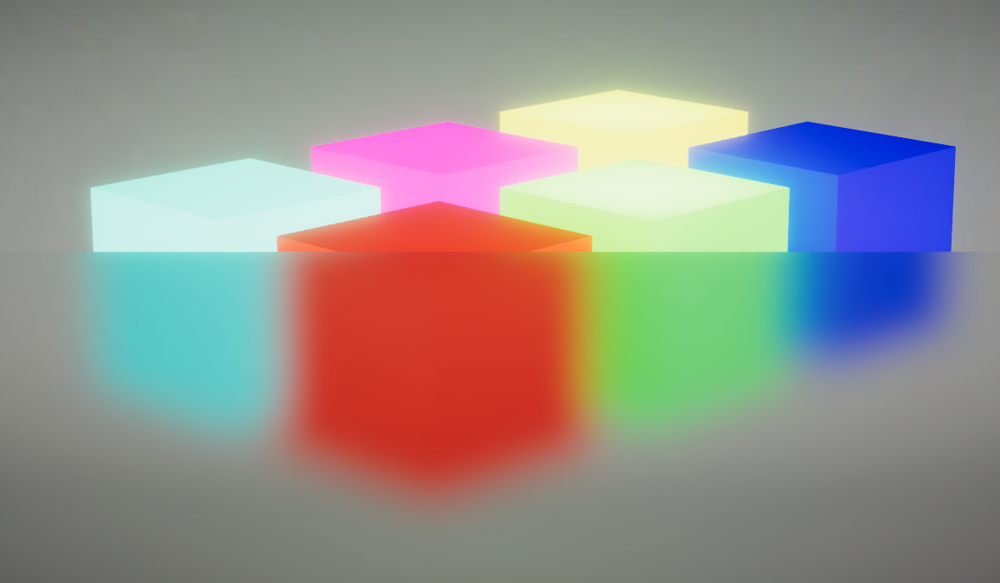

## Kawase Blur
### Renderer Extension for Universal Render Pipeline

This is a experimental RenderFeature implementation that:
* implements a post-processing-like effect in URP using ScriptableRenderFeatures
* renders multiple passes using CommandBuffers in RenderFeatures
* provides a simple yet effective blur, based on the Kawase blur as described in this [article](https://software.intel.com/en-us/blogs/2014/07/15/an-investigation-of-fast-real-time-gpu-based-image-blur-algorithms).

### Features
* performance friendly features,
  * variable number of blur passes
  * downscaling
* selection of materials
  * lit / unlit
  * UI-friendly with masks
* easy package installation

### Download
Download this project using the releases tab. The unitypackage contains all the files needed to setup the blur effect. The demo scene is not included.

### Video Tutorial
I've created a video tutorial on how to install and use this package. Check it out:
 for Free!")

### Notice
This blur will work for both 3D objects and UI images. Please note however this implementation will not allow for the blurring of other UI elements, only 3D scene elements. Also, for UI blurring to work, the canvas must be set to 'Screen Space - Camera' or 'World Space', and not 'Screen Space - Overlay'.

### Demo scene

### Masked shaders
Masked shader variants can be used to blur UI elements with rounded corners properly. To do this, simply attach a material using the masked shader onto a UI image component, and change the mask to an image with transparency. If the image has been sliced to allow for resizing, also set the sprite on the image component to the same mask.

Blur originally developed with Unity 2019.3.
Demo scene & project restructure done with Unity 2020.1.
